# 韦东山imx6ull开发板u-boot移植

完全从从u-boot官方发布的源码来适配自己的开发板是困难的，一般芯片厂商会做自己的开发板，并且移植u-boot对自己的开发板做适配，而开发板厂商或者个人用户在设计电路时可以参考芯片厂商的板子，在其适配过u-boot上进行修改，即板级的移植，这在很大程度上减小了移植的难度。

**这里参考正点原子和韦东山的教程，基于NXP的u-boot对韦东山开发板进行适配**。考虑到目前主要使用u-boot从网络启动linux，所以首先对网卡做出适配。

不论是韦东山还是正点原子的开发板，都与NXP的开发板有所不同，先查看三者的原理图。

首先是**NXP的KSZ8081RNB芯片**的原理图。

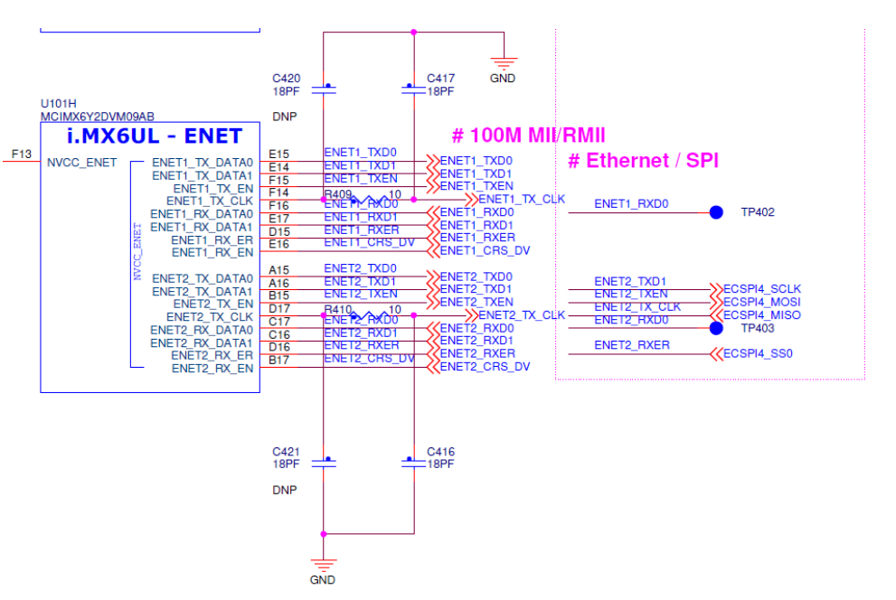

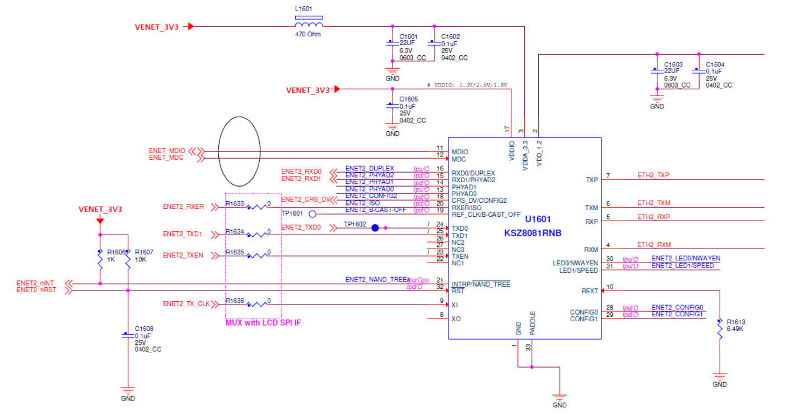

其次是**韦东山开发板的LAN8720A芯**片原理图。

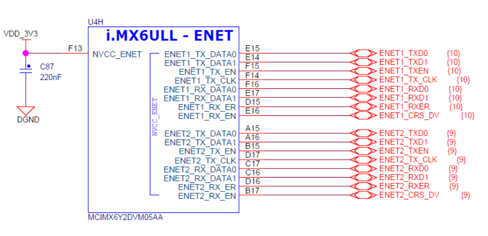

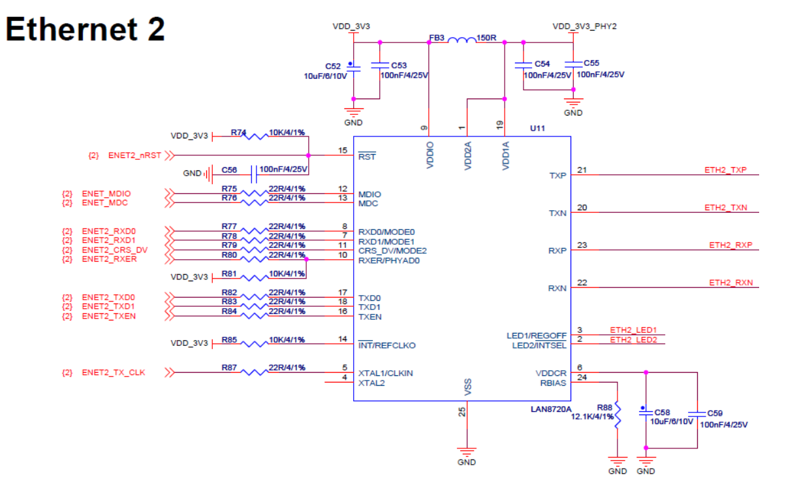

最后是**正点原子的LAN8720A芯片**原理图。

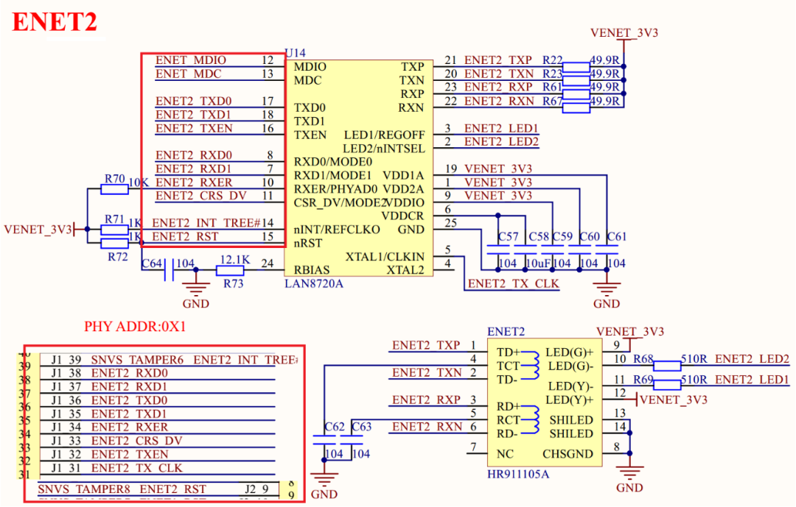

通过对比，不难发现，虽然韦东山和正点原子都更换PHY芯片为LAN8720A，但是PHY芯片使用的通信接口是没有变的，仅仅是复位IO做出了改变，具体变化如下。

| 网卡  | 复位脚       | 厂家     | io        |
| ----- | ------------ | -------- | --------- |
| 网卡0 | SNVS_TAMPER9 | 100ask   | gpio5.IO9 |
| 网卡1 | SNVS_TAMPER6 | 100ask   | gpio5.IO6 |
| 网卡0 | SNVS_TAMPER7 | 正点原子 | gpio5.IO7 |
| 网卡1 | SNVS_TAMPER8 | 正点原子 | gpio5.IO8 |

要解决的问题已经分析清楚，下面开始移植。

## 解压NXP的uboot源码

```
tar -xvf uboot-imx-rel_imx_4.1.15_2.1.0_ga.tar
```

## 建立vscode工程

打开源码所在文件夹，另存为工作区，保存工作区名为：uboot。使用vscode主要是使用其编辑器，避免使用vi操作不便。

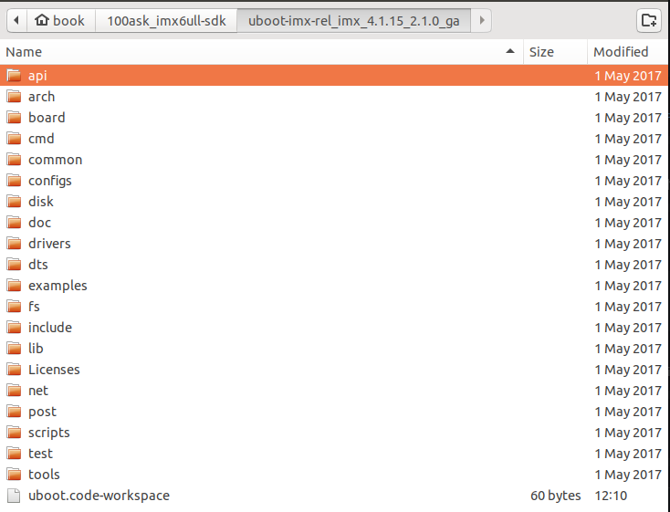

## 修改uboot配置

由于更换了PHY芯片，所以需要修改uboot配置，使其知道使用的是哪一种片。

先编译一下官方原版的uboot。

```
make ARCH=arm CROSS_COMPILE=arm-linux-gnueabihf- mx6ull_14x14_evk_emmc_defconfig
make V=1 ARCH=arm CROSS_COMPILE=arm-linux-gnueabihf- -j16
```

大致结果如下图。

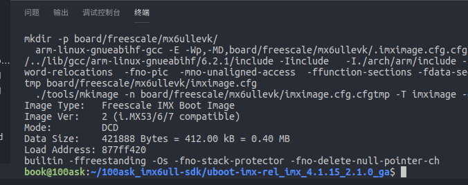

修改makefile，将CROSS_COMPILE添加到其中，以简化编译时所需输入指令。

```
vi makefile
CROSS_COMPILE=arm-linux-gnueabihf- 
```

再次测试编译：

```
make distclean
make mx6ull_14x14_evk_emmc_defconfig
make V=1 -j16
```

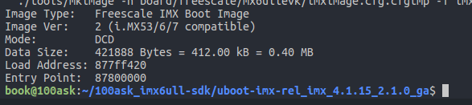

显然编译正常。

**下面正式开始修改适配韦东山开发板**，首先在**configs下**，复制一份mx6ull_14x14_evk_emmc_defconfig  文件，改名为：mx6ull_wds_emmc_defconfig

```
cd ./configs
cp mx6ull_14x14_evk_emmc_defconfig mx6ull_wds_emmc_defconfig
```

修改文件中内容：

```
mx6ullevk -> mx6ull_wds_emmc
CONFIG_TARGET_MX6ULL_14x14_EVK -> CONFIG_TARGET_MX6ULL_WDS_EMMC
```

在i**nclude/configs下**，复制一份开发板相关头文件，此文件用于配置uboot，后面会修改这个文件。

```
cd include/configs
cp mx6ullevk.h mx6ull_wds_emmc.h
```

在**board/freescale下**，添加开发板的板级文件。

```
cd board/freescale
cp mx6ullevk/ -r mx6ull_wds_emmc
cd mx6ull_wds_emmc
mv mx6ullevk.c mx6ull_wds_emmc.c
```

在**该目录下**，修改Makefile文件。

```
vi Makefile
mx6ullevk.o ->mx6ull_wds_emmc.o
```

在**该目录下**，修改imximage.cfg文件。

```
mx6ullevk -> mx6ull_wds_emmc
```

在**该目录下**，修改Kconfig文件。

```
->mx6ull_wds_emmc
```

在**该目录下**，修改MAINTAINERS文件。

```
->mx6ull_wds_emmc
```

在**arch/arm/cpu/armv7/mx6 目录下**，修改Kconfig配置uboot图形界面，加入以下代码。

```
config TARGET_MX6ULL_WDS_EMMC
	bool "Support mx6ull_wds_emmc"
	select MX6ULL
	select DM
	select DM_THERMAL
	
//在最后加入
source "board/freescale/mx6ull_wds_emmc/Kconfig"
```

在**uboot根目录下**，建立shell脚本。方便编译。

```
vi mx6ull_wds_emmc.sh

#!/bin/bash

make ARCH=arm CROSS_COMPILE=arm-linux-gnueabihf- distclean
make ARCH=arm CROSS_COMPILE=arm-linux-gnueabihf- mx6ull_wds_emmc_defconfig
make V=1 ARCH=arm CROSS_COMPILE=arm-linux-gnueabihf- -j16
```

查看文件是否被引用

```
grep -nR "mx6ull_wds_emmc.h"
```

## 修改网络驱动

### 修改PHY地址

打开**uboot源码目录下的configs目录**，并打开其中已经创建好的mx6ull_wds_emmc.h文件，这个文件是用来配置uboot的。

```
cd ./include/configs
vi mx6ull_wds_emmc.h
```

修改net0的PHY地址，**需要注意的是韦东山开发板使用了米尔科技的核心板，核心板上集成一片LAN8720A，另一片在底板上**，与正点原子不同。

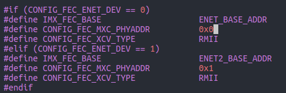

修改PHY的类型。

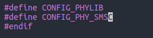

在NXP原版uboot中，**正点原子所需的复位引脚gpio5.7，gpio5.8被74LV595占用，而东山开发板中使用的是gpio5.6，gpio5.9不受影响**。

### 修改引脚复用文件

打开**board/freescale/mx6ull_wds_emmc目录**，修改mx6ull_wds_emmc.c文件。

```c
#define IOX_SDI IMX_GPIO_NR(5, 10)
#define IOX_STCP IMX_GPIO_NR(5, 7)
#define IOX_SHCP IMX_GPIO_NR(5, 11)
#define IOX_OE IMX_GPIO_NR(5, 8)
//将以上代码修改为：
#define ENET1_RESET IMX_GPIO_NR(5, 9)
#define ENET2_RESET IMX_GPIO_NR(5, 6)
```

修改IO模式配置。

```C
static iomux_v3_cfg_t const iox_pads[] = {
/* IOX_SDI */
MX6_PAD_BOOT_MODE0__GPIO5_IO10 | MUX_PAD_CTRL(NO_PAD_CTRL),
/* IOX_SHCP */
MX6_PAD_BOOT_MODE1__GPIO5_IO11 | MUX_PAD_CTRL(NO_PAD_CTRL),
/* IOX_STCP */
MX6_PAD_SNVS_TAMPER7__GPIO5_IO07 | MUX_PAD_CTRL(NO_PAD_CTRL),
/* IOX_nOE */
MX6_PAD_SNVS_TAMPER8__GPIO5_IO08 | MUX_PAD_CTRL(NO_PAD_CTRL),
};
//将以上代码删除
//将74LV595的init和set函数删除
```

在IO结构体中加入引脚配置。

```
MX6_PAD_SNVS_TAMPER9__GPIO5_IO09| MUX_PAD_CTRL(NO_PAD_CTRL),   
MX6_PAD_SNVS_TAMPER6__GPIO5_IO06| MUX_PAD_CTRL(NO_PAD_CTRL),   
```

修改setup_iomux_fec  函数，将这两个 IO 设置为输出并且硬件复位一下 LAN8720A，这个硬件复位很重要，否则可能导致 uboot 无法识别 LAN8720A。 

```
//网口1
gpio_direction_output(ENET1_RESET, 1);
gpio_set_value(ENET1_RESET, 0);
mdelay(20);
gpio_set_value(ENET1_RESET, 1);

//网口2
gpio_direction_output(ENET2_RESET, 1);
gpio_set_value(ENET2_RESET, 0);
mdelay(20);
gpio_set_value(ENET2_RESET, 1);
```

### 修改PHY驱动

这是因为uboot中的驱动存在一些问题，所以需要做出修改。打开 **drivers/net/phy/phy.c 文件**，修改其中的 genphy_update_link 函数。

```C
cd 

//加入以下代码
#ifdef CONFIG_PHY_SMSC
    static int lan8720_flag = 0;
    int bmcr_reg = 0;
    if (lan8720_flag == 0) {
        bmcr_reg = phy_read(phydev, MDIO_DEVAD_NONE, MII_BMCR);
        phy_write(phydev, MDIO_DEVAD_NONE, MII_BMCR, BMCR_RESET);
        
        while(phy_read(phydev, MDIO_DEVAD_NONE, MII_BMCR) & 0X8000) {
        	udelay(100);
        }
        
        phy_write(phydev, MDIO_DEVAD_NONE, MII_BMCR, bmcr_reg);
        lan8720_flag = 1;
    }
#endif
```

### 重新编译

```
./mx6ull_wds_emmc.sh 
```

出现如下报错：

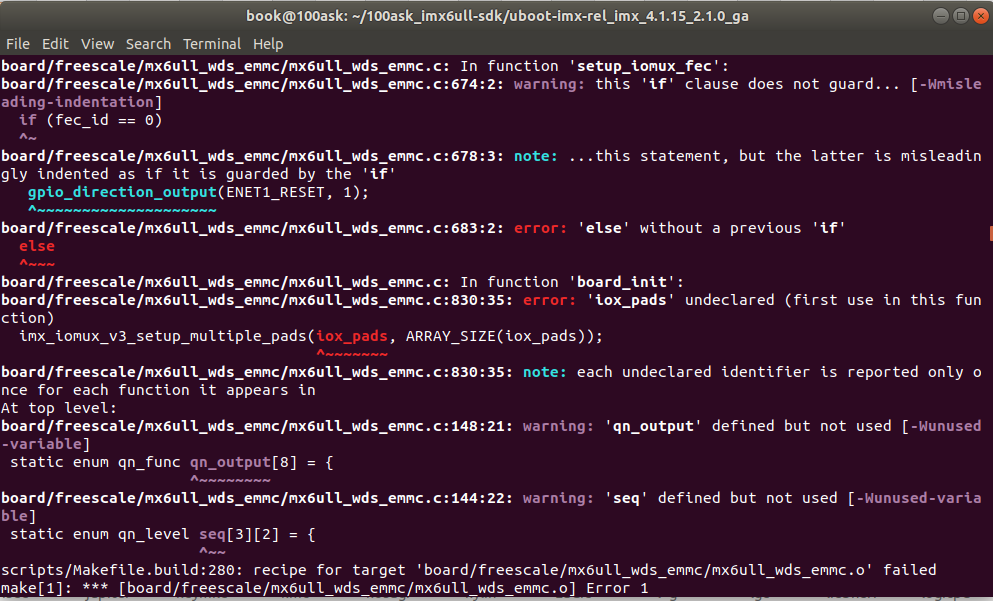

是board/freescale下的文件报错，进入文件夹查看。

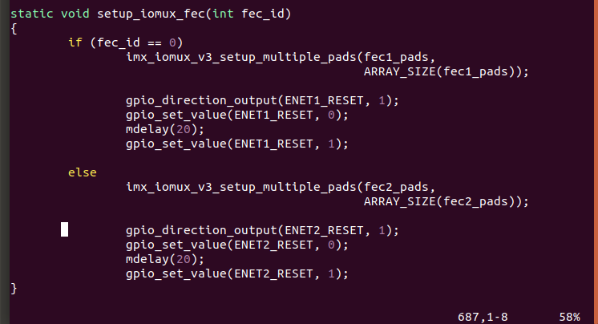

发现是因为缺少{ }，导致else没有匹配的if，修改如下。

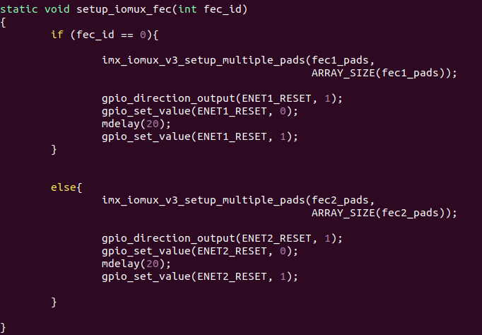

重新编译，再次报错。

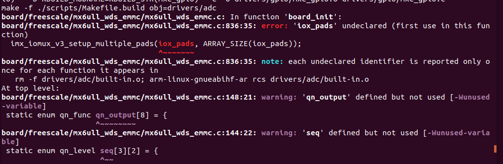

查看报错位置，发现是调用了已经删掉的函数，将其注释掉即可。

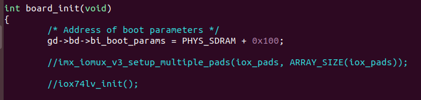

再次编译，编译成功。

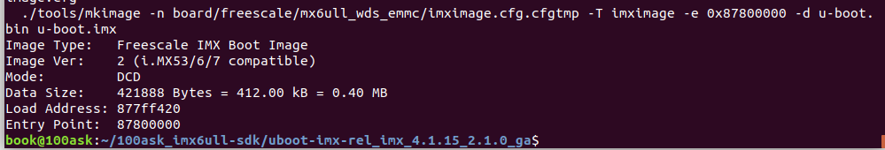

## uboot测试

### 烧写uboot到开发板

对于uboot的更新，需要注意的是，在uboot下是无法更新uboot的，可以采取以下方法：

（1）一般可以使用专门的烧写工具来更新

（2）保存到开发板文件系统或SD卡中，然后在linux下更新uboot

这里使用专用的烧写工具来烧写，先使用FileZilla将文件u-boot.imx拷贝到windows中，在使用韦东山提供的工具通过USB-OTG烧录到开发板。烧写后重启开发板，如下图所示，显示错误。

```
Net:   FEC1
Error: FEC1 address not set.
```

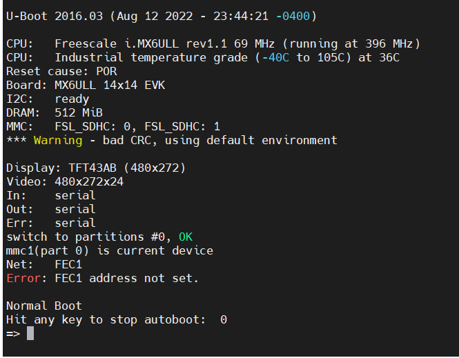

上述错误是因为没有设置MAC地址，输入以下命令：

```
setenv ethaddr b8:ae:1d:01:00:00 //开发板网卡 MAC 地址
saveenv
```

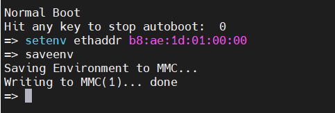


再次重启开发板。

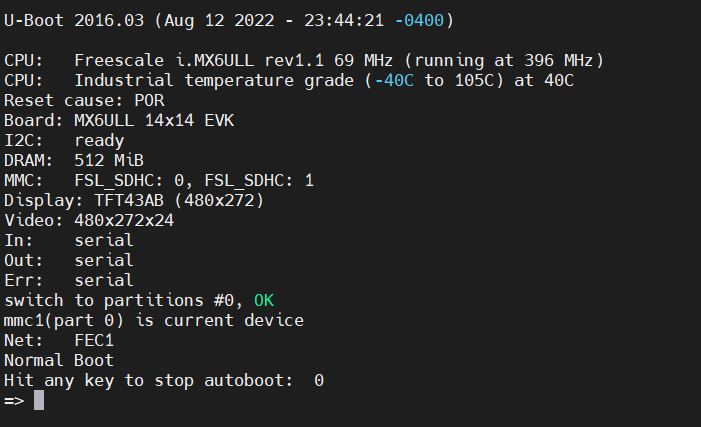

此时已经正常，ping一下ubuntu

ping 192.168.5.12

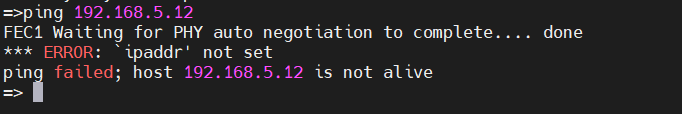

提示没有设置ipaddr，为其设置如下

```
setenv ipaddr 192.168.5.9 //开发板 IP 地址
setenv gatewayip 192.168.5.1 //开发板默认网关
setenv netmask 255.255.255.0 //开发板子网掩码
setenv serverip 192.168.5.12 //服务器地址，也就是 Ubuntu 地址
saveenv
```

再次ping一下ubuntu

```
ping 192.168.5.12
```

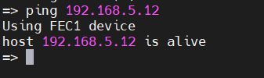

ping成功，至此uboot已经适配开发板，还可以修改一下开发板的名字，注意到在启动时，有如下输出

```
Board: MX6ULL 14x14 EVK
```

这是可以修改的，打开**board/freescale/mx6ull_wds_emmc目录**，修改mx6ull_wds_emmc.c文件。

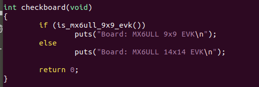

```
将这一行代码修改
puts("Board: MX6ULL 14x14 EVK\n");
//修改为
puts("Board: MX6ULL_WDS_EMMC\n");
```

重新编译并烧写，重启开发板。

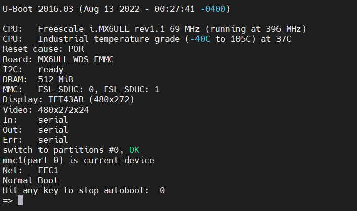

此时Board名称已经修改完成。

下面从EMMC启动linux，先为uboot修改环境变量，使用pri查看已有环境变量。

```
pri
```

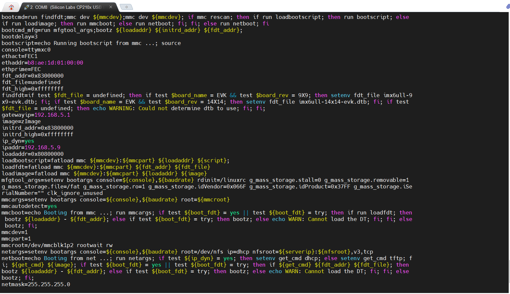

查看emmc中是否有内核和设备树文件。

```
ls mmc 1:1
```

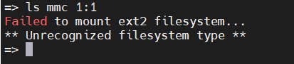

显示文件系统挂载失败，这可能是emmc驱动有问题，先尝试从网络启动。

设置bootcmd。

```
setenv bootcmd 'echo Booting from net ...; setenv serverip 192.168.5.12;setenv ipaddr 192.168.5.9; run bootargs; tftp zImage;tftp 83000000 100ask_imx6ull-14x14.dtb;bootz 80800000 - 83000000'
```

设置bootargs。

```
setenv bootargs 'console=ttymxc0,115200 root=/dev/nfs ip=192.168.5.9:192.168.5.12:192.168.5.1:255.255.255.0::eth0:off nfsroot=192.168.5.12:/home/book/nfs_rootfs/my_data/busy_box_rootfs,v3,tcp'
```

重启开发板。

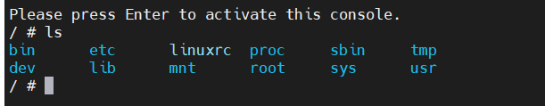

**可以正常从网络启动，这说明emmc中的文件有问题**，下面考虑如何解决。

要从emmc启动，需要能读取emmc中的内核文件，先尝试一下重新为开发板烧录Image和设备树文件。**重新烧写后错误依旧，应该是bootargs的问题**。

经过确认发现**其实是bootcmd加载内核和设备树时出现问题**，**韦东山将emmc格式化为ext2格式，NXP和正点原子使用的都是fat格式**。这导致了**默认的fatload指令无法读取文件系统**。

正点原子设置的bootcmd中使用了fatload命令，这在韦东山构建的文件系统中是无法读取的。

```
setenv bootcmd 'mmc dev 1; fatload mmc 1:1 80800000 zImage; fatload mmc 1:1 83000000 100ask_imx6ull-14x14.dtb; bootz 80800000 - 83000000;'
```

**可以使用ext2load命令来加载**，需要注意：在加载内核和设备树时不仅要指定分区，还要指明具体文件位置。

```
setenv bootcmd 'mmc dev 1;ext2load mmc 1:2 0x80800000 /boot/zImage; ext2load mmc 1:2 0x83000000 /boot/100ask_imx6ull-14x14.dtb;bootz 80800000 - 83000000;'
```

设置bootargs，bootargs 保存着 uboot 传递给 Linux 内核的参数  。

```
setenv bootargs 'console=ttymxc0,115200 root=/dev/mmcblk1p2 rootwait rw'
```

修改后能够正常进入系统！

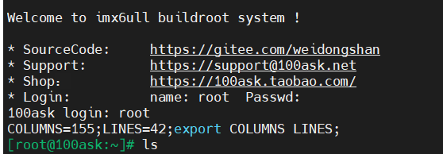
