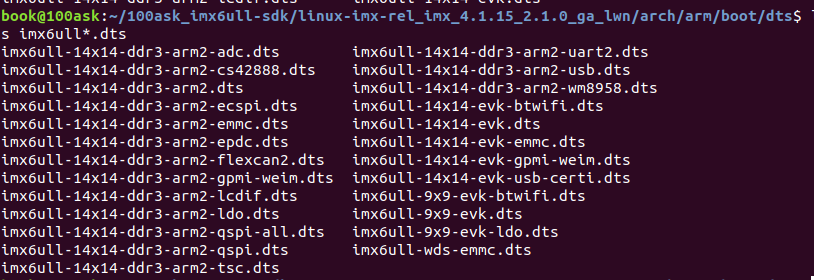

# linux内核移植

参考官方开发板移植的内核，将其适配到韦东山开发板。

## 创建工程

创建vscode工程，修改.vscode/settings.json 文件。


## 修改makefile

加入交叉编译选项

```
CROSS_COMPILE=arm-linux-gnueabihf- 
```


## 适配开发板

### 添加开发板默认配置文件

将 arch/arm/configs 目 录 下 的 imx_v7_mfg_defconfig 重 新 复 制 一 份 ， 命 名 为imx_wds_emmc_defconfig，命令如下：

```
cd arch/arm/configs
cp imx_v7_mfg_defconfig imx_wds_emmc_defconfig  
```


### 添加设备树对应文件

**注意：源码文件夹不要搞错！**

```
cd arch/arm/boot/dts
cp imx6ull-14x14-evk.dts imx6ull-wds-emmc.dts
```



修改设备树makefile，打开arch/arm/boot/dts/Makefile 。


为开发板加入所需的设备树文件

```
imx6ull-wds-emmc.dtb\
```

### 编译测试

编写编译脚本

```
vi imx6ull_wds_emmc.sh

//加入以下内容
#!/bin/sh
make ARCH=arm CROSS_COMPILE=arm-linux-gnueabihf- distclean
make ARCH=arm CROSS_COMPILE=arm-linux-gnueabihf- imx_wds_emmc_defconfig
make ARCH=arm CROSS_COMPILE=arm-linux-gnueabihf- menuconfig #打开图形界面，可以去掉
make ARCH=arm CROSS_COMPILE=arm-linux-gnueabihf- all
```

修改权限并执行

```
chmod 777 imx6ull_wds_emmc.sh //给予可执行权限
./imx6ull_wds_emmc.sh //执行 shell 脚本编译内核
```

**注意：如果中途报错，可以在修改后只使用 make all来继续编译，不用先清除。**

### 启动测试

将编译好的zImage和dtb文件复制到tftpboot文件夹中，用于。

**注意：由于此时linux内核的网络驱动还有问题，所以无法使用网络文件系统；另外新的设备树文件名已经修改，所以在加载时需要注意，否则无法加载设备树。**考虑到以上问题，采取措施为：使用uboot加载内核和设备树，使用开发板上的文件系统。

先修改bootargs，

```
setenv bootargs 'console=ttymxc0,115200 root=/dev/mmcblk1p2 rootwait rw' //使用旧内核镜像可以启动
```

使用tftp加载内核镜像和设备树

```
tftp 80800000 zImage
tftp 83000000 imx6ull-wds-emmc.dtb
bootz 80800000 - 83000000
```

启动后报错：


查找资料说是glibc版本高，内核版本低，因为韦东山使用的是4.9.88版本的系统，而NXP提供的是4.1.15，并且开发板中烧写的是韦东山制作的根文件系统，所以会出现这种问题。为了解决这个问题，考虑使用其他的文件系统，**可选的文件系统有两个：分别是正点原子提供的和之前自行制作的，先尝试正点原子提供的**。

首先查看emmc分区

```
mmc dev 1
mmc part
```


经过分析，**韦东山与正点原子在emmc的分区上不一样，这一块暂时不知道如何修改emmc分区并且重新烧写根文件系统，暂不处理，使用网络文件系统启动。**

### 修改EMMC驱动

韦东山开发板上的 EMMC 采用的 8 位数据线，而linux的EMMC驱动默认是4位的，。

韦东山开发板emmc原理图


正点原子开发板emmc原理图


**需要注意：二者的nRST一个是上拉，一个是下拉。**

修改设备树，找到以下代码


修改为

```
pinctrl-names = "default", "state_100mhz", "state_200mhz";
pinctrl-0 = <&pinctrl_usdhc2_8bit>;
pinctrl-1 = <&pinctrl_usdhc2_8bit_100mhz>;
pinctrl-2 = <&pinctrl_usdhc2_8bit_200mhz>;
bus-width = <8>;
non-removable;
status = "okay";
```


### 修改网络驱动

参考1：[参考正点原子教程移植linux内核到韦东山开发板](https://blog.csdn.net/weixin_42104550/article/details/113729443)

**需要注意：韦东山和正点原子使用的复位引脚不同，可以参考移植部分的说明。**

在 imx6ull-wds-emmc.dts 里面找到名为“iomuxc_snvs”的节点，然后在此节点下添加网络复位引脚信息，先添加net2的信息

```
		/*enet1 reset */
		pinctrl_enet1_reset: enet1resetgrp {
						fsl,pins = <
								/* used for enet2 reset */
								MX6ULL_PAD_SNVS_TAMPER9__GPIO5_IO09 0x10B0
						>;
 				};
		/*enet2 reset */
		pinctrl_enet2_reset: enet2resetgrp {
						fsl,pins = <
								/* used for enet2 reset */
								MX6ULL_PAD_SNVS_TAMPER6__GPIO5_IO06 0x10B0
						>;
 				};
        };
```

还需要修改一下 ENET1 和 ENET2 的网络时钟引脚配置  


修改其电器属性

```
0x4001b031 -> 0x4001b009
```

修改“fec1”和“fec2”的这两个节点，修改其中的“pinctrl-0”属性值  


在pinctrl-0中分别加入

```
&pinctrl_enet1_reset
&pinctrl_enet2_reset
```

修改 LAN8720A 的 PHY 地址


将其中的**@2和@1以及reg**修改，并**添加smsc**部分

```
ethphy0: ethernet-phy@0 {
    compatible = "ethernet-phy-ieee802.3-c22";
    smsc,disable-energy-detect;
    reg = <0>;
};

ethphy1: ethernet-phy@1 {
    compatible = "ethernet-phy-ieee802.3-c22";
    smsc,disable-energy-detect;
    reg = <1>;
};
```

在以下位置添加复位时间


```
phy-reset-gpios = <&gpio5 9 GPIO_ACTIVE_LOW>;
phy-reset-duration = <200>;

phy-reset-gpios = <&gpio5 6 GPIO_ACTIVE_LOW>;
phy-reset-duration = <200>;
```

修改fec_main.c 文件  ，打 开drivers/net/ethernet/freescale/fec_main.c，找到函数 fec_probe，在 fec_probe 中加入如下代码：  

```
fec_probe(struct platform_device *pdev)
 {


     /* 设置 MX6UL_PAD_ENET1_TX_CLK 和 MX6UL_PAD_ENET2_TX_CLK
     * 这两个 IO 的复用寄存器的 SION 位为 1。
     */
     void __iomem *IMX6U_ENET1_TX_CLK;
     void __iomem *IMX6U_ENET2_TX_CLK;

     IMX6U_ENET1_TX_CLK = ioremap(0X020E00DC, 4);
     writel(0X14, IMX6U_ENET1_TX_CLK);

     IMX6U_ENET2_TX_CLK = ioremap(0X020E00FC, 4);
     writel(0X14, IMX6U_ENET2_TX_CLK);

    ......
     return ret;
 }
```

配置 Linux 内核，使能 LAN8720 驱动  

```
make menuconfig
```

修改smsc.c文件，LAN8720A 的驱动文件是 drivers/net/phy/smsc.c，在此文件中有个叫做 smsc_phy_reset 的函数  

加入头文件

```
#include <linux/of_gpio.h>
#include <linux/io.h>
```

找到smsc_phy_reset  函数，加入

```
static int smsc_phy_reset(struct phy_device *phydev)
{
	int err, phy_reset;
	int msec = 1;
	int rc;
	int timeout = 50000;
	struct device_node *np;

	np = NULL;

	if(phydev->addr == 0) /* FEC1  */ {
		np = of_find_node_by_path("/soc/aips-bus@02100000/ethernet@02188000");
		if(np == NULL) {
			return -EINVAL;
		}
	}

	if(phydev->addr == 1) /* FEC2  */ {
		np = of_find_node_by_path("/soc/aips-bus@02000000/ethernet@020b4000");
		if(np == NULL) {
			return -EINVAL;
		}
	}

	err = of_property_read_u32(np, "phy-reset-duration", &msec);
	/* A sane reset duration should not be longer than 1s */
	if (!err && msec > 1000)
		msec = 1;
	phy_reset = of_get_named_gpio(np, "phy-reset-gpios", 0);
	if (!gpio_is_valid(phy_reset))
		gpio_free(phy_reset);

	gpio_direction_output(phy_reset, 0);
	gpio_set_value(phy_reset, 0);
	msleep(msec);
	gpio_set_value(phy_reset, 1);

	rc = phy_read(phydev, MII_LAN83C185_SPECIAL_MODES);
	if (rc < 0)
		return rc;

	/* If the SMSC PHY is in power down mode, then set it
	 * in all capable mode before using it.
	 */
	if ((rc & MII_LAN83C185_MODE_MASK) == MII_LAN83C185_MODE_POWERDOWN) {

		/* set "all capable" mode and reset the phy */
		rc |= MII_LAN83C185_MODE_ALL;
		phy_write(phydev, MII_LAN83C185_SPECIAL_MODES, rc);
	}

	phy_write(phydev, MII_BMCR, BMCR_RESET);
	/* wait end of reset (max 500 ms) */
	do {
		udelay(10);
		if (timeout-- == 0)
			return -1;
		rc = phy_read(phydev, MII_BMCR);
	} while (rc & BMCR_RESET);

	return 0;
}
```

### 重新编译

**注意：由于使用图形界面进行网卡驱动的使能，所以不要再distclean。**

```
make menuconfig
//修改配置
make ARCH=arm CROSS_COMPILE=arm-linux-gnueabihf- all -j16
```

### 设置从网络启动

设置bootcmd，**注意：imx6ull-wds-emmc.dtb修改了**。

```
setenv bootcmd 'echo Booting from net ...; setenv serverip 192.168.5.12;setenv ipaddr 192.168.5.9; run bootargs; tftp zImage;tftp 83000000 imx6ull-wds-emmc.dtb;bootz 80800000 - 83000000'
```

设置bootargs。

```
setenv bootargs 'console=ttymxc0,115200 root=/dev/nfs ip=192.168.5.9:192.168.5.12:192.168.5.1:255.255.255.0::eth0:off nfsroot=192.168.5.12:/home/book/nfs_rootfs/my_data/busy_box_rootfs,v3,tcp'
```

重启开发板。

```
reset
```

报如下错误


这是因为此时linux内核网络有问题，无法挂载nfs文件系统，导致网络文件系统启动失败，**发现输出中有以下提示**。


显示使用的还是Generic PHY，**这可能是SMSC的网络驱动没有设置成功**。

检查配置文件，并重新编译。


网卡驱动已经正常，但是，仍然无法挂载nfs，**经过检查发现是ubuntu的nfs服务出现问题，使用以下命令重启**。

```
sudo /etc/init.d/nfs-kernel-server restart
```


至此，内核移植成功。

### 对其它功能的影响

在移植了新的内核之后，发现驱动模块安装出现问题，提示如下错误。


经过查找资料发现原因：**之前的驱动是基于韦东山内核开发的，所以无法正常安装，需要修改源码目录和makefile**，将驱动重新编译即可解决。考虑到还要测试其他功能，将旧的设备树已经修改的内容在全部同步到新的设备树工作量较大，所以暂时使用旧的设备树和内核。

