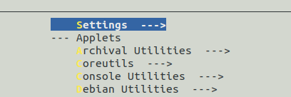

# 根文件系统的创建

根文件系统是Linux系统的重要组成部分之一，有了文件系统才可以挂载各种设备。在Linux驱动开发过程中，常常采取使用tftp从PC机加载linux内核和设备树复制到开发板内存中，并使用NFS从PC机上挂载文件系统的方式。这样做的好处是修改内核和设备树后不需要烧录到开发板的Flash中，在驱动程序交叉编译完成后不需要另外挂载NFS目录。

在学习过程中使用了韦东山的imx6ull开发板，但其教程稍显混乱，缺乏细节，所以同时也参考了正点原子的教程。韦东山的教程中使用buildroot构建了根文件系统，但是并没有配置buildroot的一些细节，这导致在学习过程中多次遇到了文件系统挂载失败的问题，具体表现为一直卡在DHCP Requesting，经过长时间的查找资料发现是因为其根文件系统中加入了一些网络服务相关的脚本，影响了文件系统的挂载。问题虽然解决了，但是仍然对根文件系统的制作十分模糊，所以这里参考正点原子和网络资料使用busybox来制作根文件系统。下面记录制作根文件系统的过程。

## 修改busybox顶层makefile

之前已经在~/.bashrc文件中加入了目标平台和交叉编译工具路径的环境变量，如下：

```
export ARCH=arm
export PATH=$PATH:/home/book/100ask_imx6ull-sdk/ToolChain/arm-buildroot-linux-gnueabihf_sdk-buildroot/bin
export PATH=$PATH:/home/book/100ask_imx6ull-sdk/ToolChain/gcc-linaro-6.2.1-2016.11-x86_64_arm-linux-gnueabihf/bin

```

所以这里只需要在makfile中，所以这里只需要加入代码指定编译器即可。

```
CROSS_COMPILE ?= arm-linux-guneabihf-
```

以上用法是借助了环境变量，也可以直接指明完整路径。

```
CROSS_COMPILE ?= /home/book/100ask_imx6ull-sdk/ToolChain/gcc-linaro-6.2.1-2016.11-x86_64_arm-linux-gnueabihf/bin/arm-linux-guneabihf-
```

在修改好makefile后，需要对busybox进行配置，执行以下指令进行默认配置。

```
make defconfig
```

在默认配置后，还需要打开图形界面做专门的配置。

```
make menuconfig
```

选择Settings   --->。



选择 [*] don't use /usr。


## 编译并安装

编译并安装根文件系统到nfs目录。

```
make
make install CONFIG_PREFIX=/home/book/nfs_rootfs/my_data/busy_box_rootfs/

```

## 添加文件

此时busy_box_rootfs文件夹下已经有了基本的文件，下面为其添加一些lib库文件。挂载到交叉编译工具链文件夹下的lib文件夹下，并将.so文件复制到新制作根文件系统中。

```
cd ....../arm-linux-gnueabihf/libc/lib //其中的省略号表示交叉编译工具的路径
cp *so* *.a /home/book/nfs_rootfs/my_data/busy_box_rootfs/lib/ -d
cd ....../arm-linux-gnueabihf/lib
cp *so* *.a /home/book/nfs_rootfs/my_data/busy_box_rootfs/lib/ -d
```

下面添加linux启动后需要使用的一些配置文件。

### 创建rcS文件

rcS 是个 shell 脚本， Linux 内核启动以后需要启动一些服务，而 rcS 就是规定启动哪些文件的脚本文件。在 busy_box_rootfs中创建/etc/init.d/rcS 文件，然后在 rcS 中输入如下所示内容。

```
mkdir /etc/init.d
vi rcS
# 这是一个脚本文件，用/bin/sh解析
#!/bin/sh
# 挂载文件系统
mount -a
# 使用内存文件系统
mkdir /dev/pts
mount -t devpts devpts /dev/pts
echo /sbin/mdev > /proc/sys/kernel/hotplug
mdev -s
# 设置IP
#/sbin/ifconfig eth0 192.168.1.17 #nfs不需要
# 挂载 /etc/fstab 中的文件系统
mount -a
exec /etc/rc.local
```

### 创建fstab 文件  

在etc文件夹下创建fstab文件，该文件在 Linux 开机以后自动配置哪些需要自动挂载的分区。

```
vi fstab
# device mount-point type options dump fsck order
proc  /proc proc defaults 0 0
sysfs  /sys sysfs defaults 0 0
tmpfs /tmp tmpfs defaults 0 0
tmpfs /dev tmpfs defaults 0 0
```

### 创建rc.local文件  

在etc文件夹下创建rc.local文件。

```
vi rc.local
#!/bin/sh
. /etc/profile //注意.后边有个空格！
```

### 创建inittab

在etc文件夹下创建inittab文件。

```
vi inittab
::sysinit:/etc/init.d/rcS
::askfirst:-/bin/sh
::ctrlaltdel:/sbin/reboot
::shutdown:/bin/umount -a -r
```

### 创建 /dev 目录

在busy_box_rootfs文件夹下创建dev文件夹，并创建两个文件。

```
mkdir dev
cd ./dev
sudo mknod console c 5 1
sudo mknod null   c 1 3
```

### 创建其它目录

```
mkdir proc mnt tmp sys root usr lib
```

至此，根文件系统所需要的文件已经全部添加完成。

## 设置开发板从网络启动

先设置ip地址。

```
setenv ethaddr b8:ae:1d:01:00:00 //开发板网卡 MAC 地址
setenv ipaddr 192.168.5.9 //开发板 IP 地址
setenv gatewayip 192.168.5.1 //开发板默认网关
setenv netmask 255.255.255.0 //开发板子网掩码
setenv serverip 192.168.5.12 //服务器地址，也就是 Ubuntu 地址
saveenv
```

在制作好网络文件系统后，为方便后续的使用，设置每次启动时自动的从ubuntu加载内核和设备树，并使用ubuntu上的文件系统。为此，需要在uboot中设置bootargs和bootcmd两个环境变量。

在bootcmd中 保存着 uboot 默认命令， uboot 倒计时结束以后就会执行 bootcmd 中的命令。这些命令一般都是用来启动 Linux 内核的，比如读取 EMMC 或者 NAND Flash 中的 Linux 内核镜像文件和设备树文件到 DRAM 中，然后启动 Linux 内核。可以在 uboot 启动以后进入命令行设置 bootcmd 环境变量的值。bootargs 保存着 uboot 传递给 Linux 内核的参数， 其一般是通过mmcargs 设置的，也可以使用setenv直接对其进行设置。

### 设置bootcmd

先将旧的bootcmd备份，以便于后续恢复，备份如下：

```
setenv bootcmd 'run updateset;run findfdt;run findtee;mmc dev ${mmcdev};mmc dev ${mmcdev}; if mmc rescan; then if run loadbootscript; then run bootscript; else if run loadimage; then run mmcboot; else run netboot; fi; fi; else run netboot; fi;'
```

在写入新的bootcmd：

```
setenv bootcmd 'echo Booting from net ...; setenv serverip 192.168.5.12;setenv ipaddr 192.168.5.9; run bootargs; tftp zImage;tftp 83000000 100ask_imx6ull-14x14.dtb;bootz 80800000 - 83000000'
```

### 设置bootargs

```
setenv bootargs 'console=ttymxc0,115200 root=/dev/nfs ip=192.168.5.9:192.168.5.12:192.168.5.1:255.255.255.0::eth0:off nfsroot=192.168.5.12:/home/book/nfs_rootfs/my_data/busy_box_rootfs,v3,tcp'
```

### 保存修改

保存修改并重新启动，自动使用网络文件系统。

```
saveenv
```

## 错误处理

在第一次重启后，无法进入系统，提示以下错误：

```
Bad inittab entry at line 1
Bad inittab entry at line 2
Bad inittab entry at line 4
Bad inittab entry at line 6
can't open /dev/  : No such file or directory
```

这个报错是因为init.d文件夹和rc.local没有执行权限，导致后面运行inittab文件出错，做出如下修改：

```
chmod -R 777 init.d
chmod 777 fstab
```

再次重启，先加载内核和设备树。


成功进入系统，可以看到使用的是新制作的文件系统。

