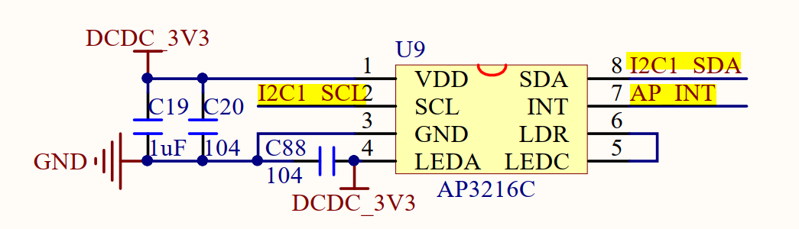

# IIC驱动

参考1：[Linux驱动开发—内核I2C驱动详解](https://blog.csdn.net/qq_45172832/article/details/125797393)

## 原理图分析

### 韦东山原理图


### 正点原子与原理图




## 回顾裸机开发流程

编写IIC控制器驱动，提供IIC的transfer等函数，在需要使用子程序中调用即可。

## Linux下IIC驱动开发

### 基本流程

（1）IIC控制器驱动（适配器驱动），一般由SOC厂商做好适配，如果在电路上有改动，需要注意IO的重映射。

（2）设备驱动，在IIC总线上挂载设备时，为设备开发调用控制器驱动提供的总线操作函数即可。

### IIC适配器驱动

本质上是与platform总线类似的总线，需要提供设备的匹配等操作，还要为设备提供操作总线的函数。

## 修改设备树

在设备树中添加AP3216C节点信息。打开Linux源码下的100ask_imx6ull-14x14.dts文件。

### 修改pinctrl部分

在&iomuxc下，找到IIC对的pinctrl部分，按原理图进行修改，具体引脚名可以到以下文件中搜索。

 

修改后的pinctrl如下。


### 创建AP3216C节点

找到以下部分


在&i2c1下添加


## 编写AP3216C.h文件

```
#ifndef AP3216C_H

#define AP3216C_H

#define AP3216C_ADDR    	0X1E	/* AP3216C器件地址  */

/* AP3316C寄存器 */
#define AP3216C_SYSTEMCONG	0x00	/* 配置寄存器       */
#define AP3216C_INTSTATUS	0X01	/* 中断状态寄存器   */
#define AP3216C_INTCLEAR	0X02	/* 中断清除寄存器   */
#define AP3216C_IRDATALOW	0x0A	/* IR数据低字节     */
#define AP3216C_IRDATAHIGH	0x0B	/* IR数据高字节     */
#define AP3216C_ALSDATALOW	0x0C	/* ALS数据低字节    */
#define AP3216C_ALSDATAHIGH	0X0D	/* ALS数据高字节    */
#define AP3216C_PSDATALOW	0X0E	/* PS数据低字节     */
#define AP3216C_PSDATAHIGH	0X0F	/* PS数据高字节     */

#endif //
```

## 编写AP3216C.c文件

### init

添加i2c设备驱动12c_add_driver

### i2c驱动结构体

包含probe、remove函数，还要为.driver提供of_match_table

### i2c驱动结构体

```
static struct i2c_driver ap3216c_driver = {
	.probe = ap3216c_probe,
	.remove = ap3216c_remove,
	.driver = {
			.owner = THIS_MODULE,
		   	.name = "ap3216c",
		   	.of_match_table = ap3216c_of_match, 
		   },
	.id_table = ap3216c_id,
};
```

### of_match_table

```
static const struct of_device_id ap3216c_of_match[] = {
	{ .compatible = "alientek,ap3216c" },
	{ /* Sentinel */ }
};

```

### 编写probe函数，主要是注册字符设备的流程

```
static int ap3216c_probe(struct i2c_client *client, const struct i2c_device_id *id){

	return 0;

}
```

### 字符设备流程

#### 创建设备结构体


#### 提供设备操作函数集合


#### 申请设备号


#### 初始化字符设备


#### 注册字符设备


#### 创建类

注意要接收返回的指针

#### 创建设备

注意要接收返回的指针

#### 实现open、write等函数


#### 实现设备所需的寄存器读写函数

（1）i2c_msg结构体

```
struct i2c_msg {
	__u16 addr;	/* slave address			*/
	__u16 flags;
#define I2C_M_RD		0x0001	/* read data, from slave to master */
					/* I2C_M_RD is guaranteed to be 0x0001! */
#define I2C_M_TEN		0x0010	/* this is a ten bit chip address */
#define I2C_M_RECV_LEN		0x0400	/* length will be first received byte */
#define I2C_M_NO_RD_ACK		0x0800	/* if I2C_FUNC_PROTOCOL_MANGLING */
#define I2C_M_IGNORE_NAK	0x1000	/* if I2C_FUNC_PROTOCOL_MANGLING */
#define I2C_M_REV_DIR_ADDR	0x2000	/* if I2C_FUNC_PROTOCOL_MANGLING */
#define I2C_M_NOSTART		0x4000	/* if I2C_FUNC_NOSTART */
#define I2C_M_STOP		0x8000	/* if I2C_FUNC_PROTOCOL_MANGLING */
	__u16 len;		/* msg length				*/
	__u8 *buf;		/* pointer to msg data			*/
};
```

描述了从机地址，读写标志，数据缓存区，msg长度等信息。**需要注意：** 一个i2c_msg结构的变量，代表着一次单方向的传输，故我们如果需要进行读写操作就需要两个i2c_msg结构的变量，分别通过对结构体成员变量flag的赋值来确定传输方向。

（2）i2c_transfer介绍：**位于drivers/i2c/i2c-core.h中**

```
/**
 * i2c_transfer - execute a single or combined I2C message
 * @adap: Handle to I2C bus
 * @msgs: One or more messages to execute before STOP is issued to
 *	terminate the operation; each message begins with a START.
 * @num: Number of messages to be executed.
 *
 * Returns negative errno, else the number of messages executed.
 *
 * Note that there is no requirement that each message be sent to
 * the same slave address, although that is the most common model.
 */
int i2c_transfer(struct i2c_adapter *adap, struct i2c_msg *msgs, int num)
{
	int ret;

	/* REVISIT the fault reporting model here is weak:
	 *
	 *  - When we get an error after receiving N bytes from a slave,
	 *    there is no way to report "N".
	 *
	 *  - When we get a NAK after transmitting N bytes to a slave,
	 *    there is no way to report "N" ... or to let the master
	 *    continue executing the rest of this combined message, if
	 *    that's the appropriate response.
	 *
	 *  - When for example "num" is two and we successfully complete
	 *    the first message but get an error part way through the
	 *    second, it's unclear whether that should be reported as
	 *    one (discarding status on the second message) or errno
	 *    (discarding status on the first one).
	 */

	if (adap->algo->master_xfer) {
#ifdef DEBUG
		for (ret = 0; ret < num; ret++) {
			dev_dbg(&adap->dev,
				"master_xfer[%d] %c, addr=0x%02x, len=%d%s\n",
				ret, (msgs[ret].flags & I2C_M_RD) ? 'R' : 'W',
				msgs[ret].addr, msgs[ret].len,
				(msgs[ret].flags & I2C_M_RECV_LEN) ? "+" : "");
		}
#endif

		if (in_atomic() || irqs_disabled()) {
			ret = i2c_trylock_bus(adap, I2C_LOCK_SEGMENT);
			if (!ret)
				/* I2C activity is ongoing. */
				return -EAGAIN;
		} else {
			i2c_lock_bus(adap, I2C_LOCK_SEGMENT);
		}

		ret = __i2c_transfer(adap, msgs, num);
		i2c_unlock_bus(adap, I2C_LOCK_SEGMENT);

		return ret;
	} else {
		dev_dbg(&adap->dev, "I2C level transfers not supported\n");
		return -EOPNOTSUPP;
	}
}
EXPORT_SYMBOL(i2c_transfer);
```

（3）write_regs

```
struct i2c_client *client = (struct i2c_client *)dev->private_data;
struct i2c_msg msg;
u8 databuf[256]; //缓存区

//拷贝数据到缓存区
databuf[0] = reg;
memcpy(databuf,buf[1],len);

//设置msg
msg.addr = client->addr;//指定器件地址
msg.buf = databuf;
msg.flags = 0;//写数据
msg.len = len+1;

//最后一个参数表示msg数量，而不是长度，也就是消息帧的数量
ret = i2c_transfer(client->adapter,&msg,1);//占用总线

return ret;
```

### 编写remove函数

#### 删除cdev

说明一下cdev和字符设备的关系：

#### 注销字符设备


#### 销毁device


#### 销毁类

### 测试驱动

先打开终端打印权限

```
echo "7 4 1 7" > /proc/sys/kernel/printk
```

安装模块

```
insmod AP3216C.ko
```

得到以下结果。


## 编写AP2316CApp.c

### 实现功能

调用open打开设备，调用read读取设备。

编译App代码：

```
arm-buildroot-linux-gnueabihf-gcc AP3216CApp.c -o AP3216CApp
```

### 测试App

```
./AP3216CApp /dev/ap3216c
```

可以看到如下结果。


至此，i2c驱动编写完成。
