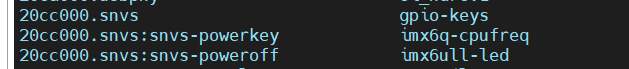
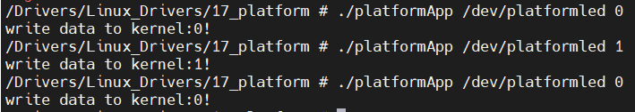

# 使用platform驱动led

在linux驱动开发过程中，往往会有将一个设备用于多个平台的情况，由于各个平台的通信接口或通信总线实现有所不同，这就导致了要在该平台使用某设备时需要做专门的适配，针对平台特性的代码与设备的驱动代码耦合在一起，在更换平台或者更换设备时，驱动程序需要做出很的大修改，这是十分耗费精力的。为了解决上述问题，可以将二者解耦，即平台实现自己的通信接口或通信总线驱动部分，设备提供自己的驱动代码，使用中间层将二者连接起来，做出适配，这样在更换平台或设备时只需要修改中间层即可。

上述解决方案其实就是总线、驱动和设备模型，驱动是指针对具体设备的驱动代码，设备是指对各种目标设备的描述代码，总线是指将二者连接的中间代码。在设备和驱动的划分上，可以举出一些例子：一个陀螺仪是一个设备，一个普通IO也是一个设备；一个陀螺仪需要一个驱动代码，一个IO口上的LED也需要一个驱动代码。**总线就是为驱动和设备提供一个匹配的途径，他可能提供或者不提供一些用于匹配的代码，是由操作系统内核提供的**。

对于像陀螺仪这种设备，其对应总线就是IIC总线，对于LED、ADC这种设备，就没有专门的总线，所以使用一类特殊的虚拟总线——platform总线。

在开发时，在device.c文件中，主要是实现对设备的描述，有哪些资源，然后将其注册到总线；在driver.c文件中主要是处理匹配成功的device，为其编写的驱动代码，包括字符设备的注册、删除等，使用probe、和remove函数。

其实driver.c的编写和之前直接开发驱动代码十分类似，只是将直接向内核注册设备改为向platform总线来注册，也就是说这里的驱动由platform总线接管。需要注意的是，在probe函数中会通过platform总线获取device.c中为设备设置的资源。

对于device和driver的匹配，具有多种匹配方式，可以通过name，也可以通过id等方式。

## 基于LED实验

### 建立vscode工程

修改makefile文件，由于在环境变量中已经加入了交叉编译器位置与目标平台类型，所以这里只需要指明CROSS_COMPILE即可。

```
KERNELDIR := /home/book/linux/IMX6ULL/linux/wds_linux #

CURRENT_PATH := $(shell pwd)

obj-m := leddevice.o

build : kernel_modules

kernel_modules:
	$(MAKE) -C $(KERNELDIR) M=$(CURRENT_PATH) modules

clean:
	$(MAKE) -C $(KERNELDIR) M=$(CURRENT_PATH) clean

```

执行以下命令编译。

```
make CROSS_COMPILE=arm-buildroot-linux-gnueabihf- //buildroot是与使用的编译器有关的
make CROSS_COMPILE=arm-linux-gnueabihf- //也可以使用这个编译器
```

### 编写leddevice.c文件

在此文件中给出设备所具有的资源属性，并将设备注册到总线。需要做的工作如下：

```
1.指定设备的资源
2.初始化设备结构体
3.注册platform设备
4.删除注册的设备
```


### 安装device模块

从网络文件系统启动开发板，安装模块。

```
insmod leddevice.ko
```

会有如下提示：

```
loading out-of-tree module taints kernel.
```

这是在提示加载的树外模块污染了内核。从这段描述可以猜到，这是我们没有把此驱动模块加入到Kconfig树导致的，即make menuconfig的配置选项中没有此驱动。此时这个驱动模块仍能正确加载和使用。如果我们只是学习怎么写驱动，不用管他就行；如果我们是正式地写驱动，那么把驱动信息加入到Kconfig树中是必须的，这样我们可以通过配置内核来决定哪些加载驱动，系统也不会再报`loading out-of-tree module taints kernel`的错误了。

挂载到platform目录下查看设备。

```
cd /sys/bus/platform/devices
ls
```



可以看到“imx6ull-led"已经存在。

### 编写leddriver.c文件

需要做的工作如下：

```
1.注册驱动
2.与设备匹配成功后获取设备资源
3.在probe函数中实现普通设备驱动init的流程
4.在remove函数中实现普通设备驱动exit的流程
```

### 字符设备驱动流程

需要做的工作如下：

```
1.自定义设备结构体，包含：设备号、字符设备描述结构体、class、device（用于创建设备节点）
2.实现操作函数集合
3.申请设备号
4.注册字符设备，包含：初始化cdev、添加cdev、创建class和device
5.编写操作函数集合具体函数实现
6.删除字符设备，包含：删除设备号、删除cdev、删除device、删除class
```

### 编写应用程序

需要做的工作如下：

```
1.open设备
2.向驱动程序发送数据
```

### 安装driver模块

```
insmod leddriver.ko
./platformApp /dev/platformled 0
./platformApp /dev/platformled 1
```

测试结果如下：


可以正常打开和关闭led。
