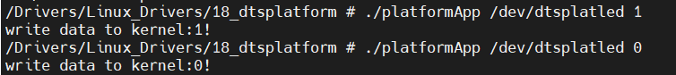

# 设备树下的platform驱动

## 设备的资源描述

在使用设备树的情况下，设备树已经提供了对设备的描述，因此不需要再单独的通过device.c去描述设备的资源。通过修改设备树，在不修改驱动的情况下，就能完成新设备的适配。实际上本实验和单独使用设备树十分类似，只是加入了一层使用platform总线适配的过程。

## 修改设备树

在设备树中加入led相关的部分。

```
gpioled{
        compatible = "gpioled";
        pinctrl-name = "default";
        pinctrl-0 = <&pinctrl_gpioled>;
        led-gpios = <&gpio5 3 GPIO_ACTIVE_LOW>;
        status = "okay";


};

pinctrl_gpioled: gpioled{

        fsl,pins = <
        MX6UL_PAD_SNVS_TAMPER3__GPIO5_IO03	0x10b0

        >;
};
```


## driver.c编写

主要完成以下工作：

```
1.创建platform驱动结构体，主要有为driver设置参数（主要有匹配列表），设置probe和remove函数
2.inti与exit函数，完成platform驱动的注册与删除
3.定义设备结构体
4.定义并实现操作函数集合
5.实现probe和move函数，在probe中实现字符设备的注册
```

## 应用程序编写

需要做的工作如下：

```
1.open设备
2.向驱动程序发送数据
```

## 安装driver模块

从网络文件系统启动，安装模块测试。

``` 0
insmod leddriver.ko
./platformApp /dev/dtsplatled 0
./platformApp /dev/dtsplatled 1
```



可以正常打开和关闭led。
