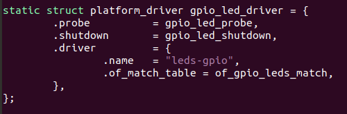
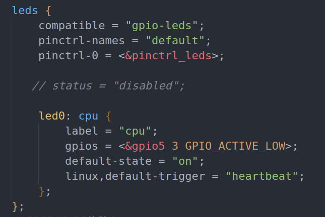
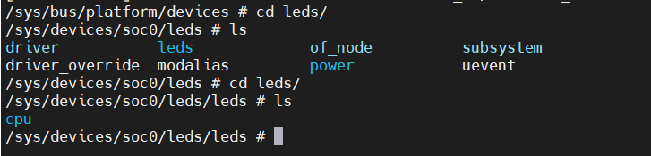
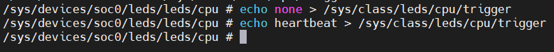

# linux自带led驱动

Linux 内核的 LED 灯驱动采用 platform 框架，因此我们只需要按照要求在设备树文件中添加相应的 LED 节点即可 ，LED 灯驱动文件为/drivers/leds/leds-gpio.c 。

文件中的compatible为gpio-leds，因此只需要在设备树中提供相应的gpio-leds就可以成功匹配。


linux自带led驱动提供的probe函数如下图所示。



修改设备树，注意：使用备份在linux文件夹下的源码。



编译设备树。

```
make CROSS_COMPILE=arm-buildroot-linux-gnueabihf- dtbs
```

更新设备树，重新启动，查看启 动 以 后 查 看/sys/bus/platform/devices。

```
cd /sys/bus/platform/devices/leds
```



可以看到，设备树已经被成功修改。

下面测试led是否能正常使用。

```
echo none > /sys/class/leds/cpu/trigger
echo heartbeat > /sys/class/leds/cpu/trigger
```



经过测试，led可以正常闪烁或者关闭。