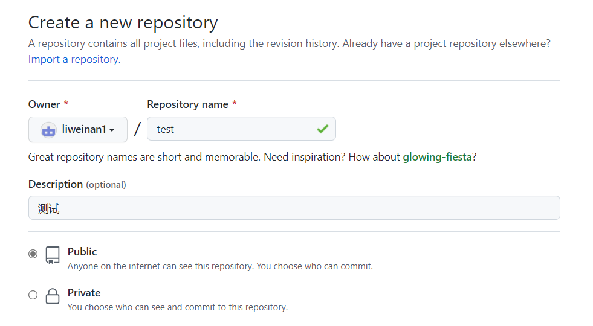

# cloud-notes-of-linux

本项目用于记录学习linux过程中的一些问题与收获，一方面方便自己复习，一方面可能可以给有需要的人提供微小的帮助。这些笔记从原来的本地Word文档迁移到Typora上，Typora是一款markdown编辑器，其加入了一些图形化编程的支持，减少了需要记忆的markdown命令，及大的提高了生产力。Typora结合github能够实现多平台的同步，并且github也提供了私有仓库的支持，对于隐私的数据可以选择私有仓库。

在本文档中的，会整理出Typora的配置方法、github的配置与基本指令，为同样有记笔记需求的朋友提供一些参考。笔记的分类会通过文件夹的命名来区分，如：开发环境配置、uboot移植、驱动开发等，在每个文件夹中会有多个.MD文件，即具体学习内容的记录。下面将会给出Typora和github的一些配置方法。

## Typora安装与配置

在[Typora官网](https://typoraio.cn/)下载安装包，这里以windows版本为例，根据自己电脑版本下载64位或32位版本。


下载文件后，双击打开，点击next。


在下一界面，点击Install，即可开始安装。


为了能将插入的图片上传到github，需要对图片进行设置，点击文件，打开派偏好设置。


选择图像，打开插入图片时下拉列表，选择复制到指定路径，将路径设置为“./image”，即当前文件夹下的image文件夹。


## 使用github上传文件

首先在github中创建仓库，点击右上角“+”号，选择“New repository”。


可以设为公有或私有，设置好后点击最下方“Create reapository”即可完成仓库创建。



将仓库clone到本地，这里使用SSH方式，复制链接。


在PC机上搜索栏打开安装的Git软件，使用Git bash。


输如如下命令进行clone，后面的地址是刚刚在github中复制的，对于自己的仓库需要修改。

```
git clone git@github.com:liweinan1/test.git
```


使用Typora打开clone到本地的仓库文件夹，编辑其中的文件，这里以README.md文件为例。


在Typora中修改文件，并保存。


在本地仓库文件中使用Git bash打开。


分别输入以下命令：

```
//第一条用于添加文件到缓冲区，其中的“*”是通配符，表示选中文件夹下所有文件下
git add *
//第二条用于说明提交了哪些修改
git commit -m "测试"
//第三条用于将选中的文件上传到github中
git push -u origin main
```

执行以上命令后，文件已经被上传到github中。


打开网页的github可以发现服务器上仓库中的文件已经被修改。


