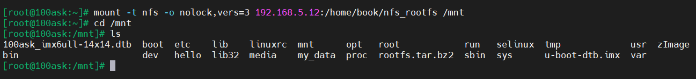
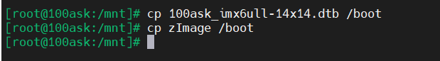
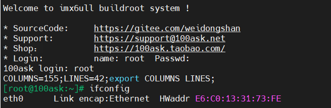

# 更新内核与设备树

在更新内核与设备树后，需要将其烧写到开发板中，可以通过使用内存卡，或者tftp、nfs这种网络的方式烧写，这里记录一下使用nfs烧写的过程。

## 复制文件到nfs目录

在ubuntu中将文件复制到nfs目录中。

```
cp zImage ~/nfs_rootfs
```

## 开发板挂载nfs

先为开发板设置ip。

```
vi /etc/network/interfaces
//加入以下内容：
auto lo
iface lo inet loopback
auto eth0
iface eth0 inet static
address 192.168.5.9
netmask 255.255.255.0
gateway 192.168.5.1
//重启网络服务：
/etc/init.d/S40network restart
```

ping一下ubuntu。

```
ping 192.168.5.12
```

挂载nfs目录。

```
mount -t nfs -o nolock,vers=3 192.168.5.12:/home/book/nfs_rootfs /mnt
```

查看挂载的目录。

```
cd /mnt
ls
```



## 更新文件

将使用ubuntu复制到nfs目录下的内核与设备树文件复制开发板/boot目录下。

```
cp 100ask_imx6ull-14x14.dtb /boot
cp zImage /boot
```



重启开发板。

```
reboot
```




至此，内核与设备树更新成功。